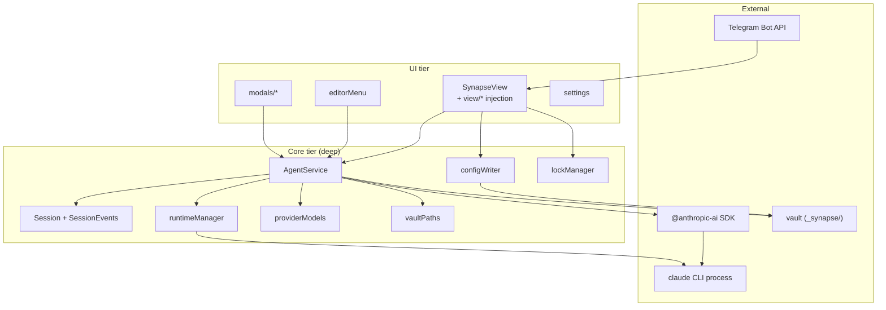
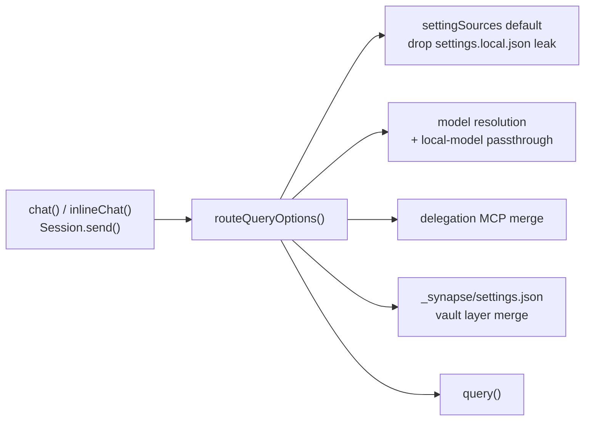
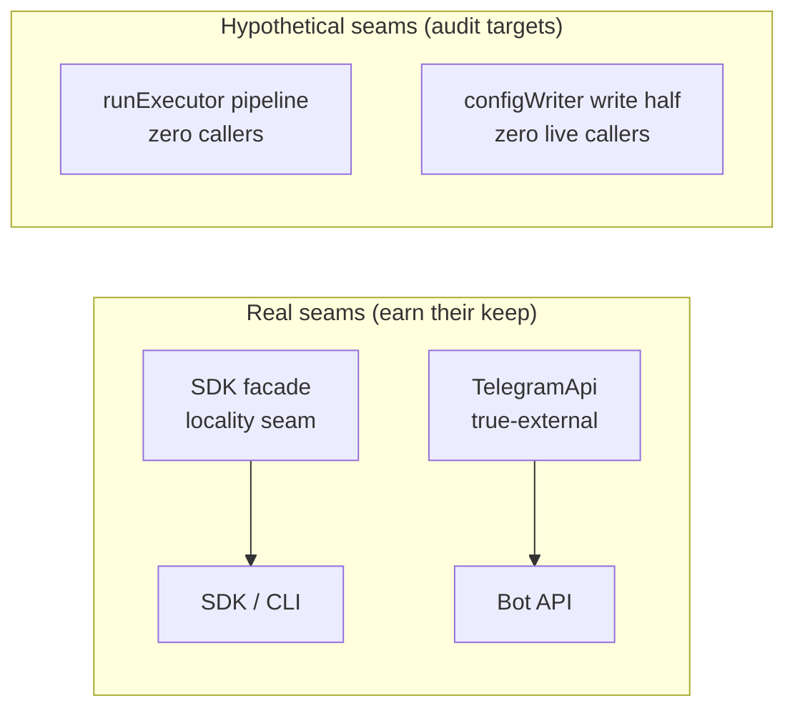
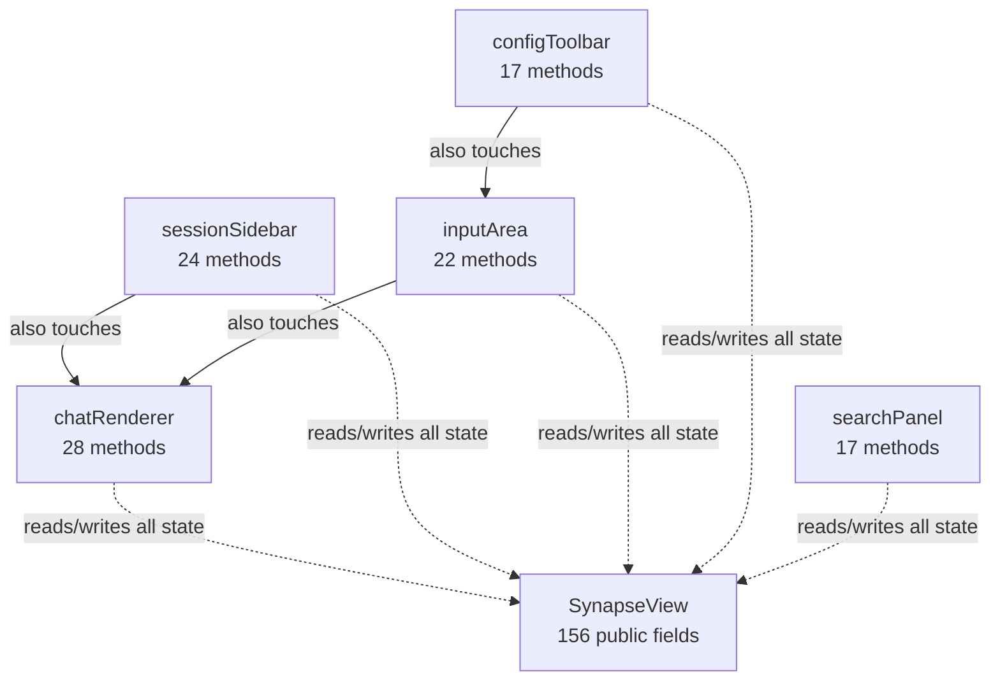
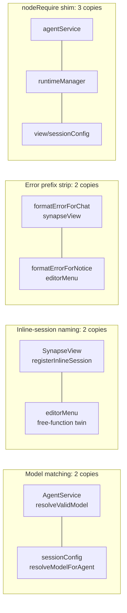
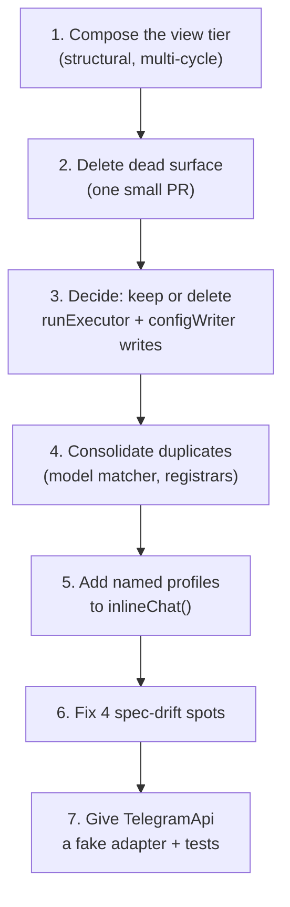

# Codebase design audit — deep modules, seams, dead surface

**Date:** 2026-09-11
**Commit audited:** `70a9ae8` (`main`)
**Method:** full read of `src/` (34 files, ~14,000 lines), all of `specs/`, and the test
suite, using the `codebase-design` skill's vocabulary: **module** (interface +
implementation), **interface** (everything a caller must know), **depth** (behaviour per
unit of interface), **seam** (where an interface lives), **adapter** (what fills a seam),
**leverage** (what callers gain), **locality** (what maintainers gain).
**Supersedes:** [`2026-09-05-codebase-design-audit.md`](2026-09-05-codebase-design-audit.md)
(that snapshot was flagged stale by #220/#221).

This is a design audit, not a bug hunt. Findings age — check they still hold before acting.

---

## 1. The system at a glance

The pattern: a **deep core** wrapped by a **god-object UI tier**. The core is in good
shape. The debt is concentrated at the top (view tier) and at a strip of dormant
infrastructure nobody calls.

---

## 2. What's deep — the strengths

The best modules give callers a lot of behaviour behind a small interface.

### `routeQueryOptions()` — the single best design in the codebase

One private choke point that every real query passes through. It hides four policies:

The leverage is measurable: when the vault settings layer (#194) was added, **none of the
~7 call sites that build `Options` changed** — they only passed an `App` handle they
already had.

### `Session` + the `SessionEvents` map

A sprawling `SDKMessage` stream becomes 14 typed events. `dispatch<K>()` / `on<K>()`
make an unknown event name or wrong payload a **compile error** on both sides. Behind
that small interface hides: resume threading across process respawns,
graceful-interrupt vs hard-abort, the refcounted `setTimeout` unref shim, partial-message
streaming dedup, and tool-grant survival.

### Small deep modules

| Module | Lines | Interface | Hidden behind it |
|---|---|---|---|
| `lockManager` | 106 | `withLock(path, fn)` | FIFO queue, 60s bounded wait, wedge-safe release |
| `vaultPaths` | 87 | 5 functions | basePath cast, POSIX normalization, no internal imports |
| `runtimeManager` | 261 | 4 functions | platform resolution chain, exec-safety guard, env allowlist, version skew |
| `providerModels` | 233 | 2 functions | connection-vs-shape error classification, probe/timeout logic |
| `debug`, `toolErrors` | ~50 | 2-3 functions each | tiny, focused, no debt |

**The pure helpers** (`buildPrompt`, `computeAdditionalDirectories`,
`decideWorkingDirAutoUpdate`, `parseTodoWritePayload`, `parseTask*`,
`buildAskUserQuestionAnswers`, `parseFrontmatter`) each sit at a real seam: no DOM, no
Obsidian, no CLI — directly unit-tested through their interface.

---

## 3. The one-adapter audit

Rule: *one adapter means a hypothetical seam*. Two adapters make it real.

- **`AgentService`'s SDK facade** — one adapter, but it earns its keep as a *locality*
  seam: when the 0.x SDK breaks, one file changes.
- **`TelegramApi`** — true-external category, so the seam is where a fake adapter should
  go. **No test file exists for `telegramBot.ts`.** The routing/queueing/allowlist logic
  is untested.
- **`runExecutor.ts` / `configWriter` write half** — see §4.

---

## 4. Dead surface — the deletion test

The deletion test: imagine deleting the surface. If complexity reappears across callers,
it earned its keep. If nothing changes, it's dead.

| Surface | Size | External callers | Verdict |
|---|---|---|---|
| `Session.rpc` (agent.select / workingDirectory.set) | ~15 lines | 2 (call a **no-op stub**); `workingDirectory.set`: **0** | **Dead** — delete |
| `SynapseView.updateToolbarLock()` | 3 lines + 5 call sites | no-op body | **Dead** — delete |
| `lockManager.isLocked()` | 8 lines | **0** | Dead — unexport or keep with a note |
| `runExecutor.routeAndRun()` | ~20 lines | 1 (itself) — pure pass-through, unused `_policy` param | **Dead** — fold into `executeWithClaude` |
| `runExecutor` full pipeline | 390 lines | **0 in-tree** (triggers removed #188, batch loops #221) | Hypothetical — decide: keep documented, or delete |
| `configWriter`: `writeAgent`, `deleteArtifact` | ~60 lines | **0** live (only `writeSkill` via seeding; `modifyArtifact` only via caller-less `runExecutor`) | Contradiction — see below |
| `AgentService.chat()` | ~70 lines | 0 external (only internal delegation tools) | Keep — internally load-bearing |

**The `configWriter` contradiction.** The spec calls its write functions "write
operations for the self-improve feature" — but the actual self-improve write path is the
CLI agent using its **own `Write` tool**. `configWriter`'s write functions are never on
that path. 472 test lines guard a seam that doesn't exist. Either they're future
infrastructure (then say so) or they're deletable.

---

## 5. The god object: `SynapseView` + prototype injection

The central design debt. `chat-view.md` admits it: converting the injection pattern to
real composition was "not done" and the gap "has no compiler-checked replacement."

The numbers:

- **156 public fields** on one class ("non-private to allow access from view modules").
- **~108 methods injected** across five view modules via `declare module` + prototype
  assignment (chatRenderer 28, sessionSidebar 24, inputArea 22, configToolbar 17,
  searchPanel 17).
- Every injected method can read and mutate every other module's state.

**The wiring is invisible to the compiler.** It's guarded instead by tests that read
source files *as text*:

- `viewInjectionWiring.test.ts` — every declaration has a `proto.` assignment; every
  `installX()` is called.
- `inlineChatCallerWiring.test.ts`, `editorial*.test.ts` — same source-parsing approach.

The skill's rule: **the interface is the test surface.** When tests parse source code to
verify wiring, the seam is missing. These tests will not survive internal refactors — the
definition of testing past the interface.

Depth verdict: the interface is nearly as large as the implementation. A maintainer must
learn ~264 public members (fields + injected methods) to touch any part of the panel.
Leverage per unit of interface: poor. Locality: poor — a streaming-lifecycle change can
require edits in four places (`synapseView.ts`, `chatRenderer.ts`, `sessionSidebar.ts`,
`BackgroundSession` in `view/types.ts`).

What keeps it workable: the pure logic was already extracted to `sessionConfig.ts` /
`utils.ts`, and `handleSessionEvent()` is a single event funnel. The debt is shared
mutable state, not logic sprawl.

---

## 6. Locality leaks — duplicated knowledge

The model-matching duplication is the worst: `agent-service.md` admits the two functions
use "the same tiers" (exact → substring → `haiku|sonnet|opus|flash|pro` keywords). One
should import the other.

`editorMenu.ts` is the second hotspot: 1,022 lines, 38 functions, 10+ `inlineChat`
call sites, each hand-building the prompt + options + notice dance. The two-profile
convention (text transforms: `tools: [] + maxTurns: 1`; vision: `tools: ['Read']`)
is enforced only by comments and source-text tests.

---

## 7. How the specs describe the code

Overall verdict: **`specs/` is interface documentation in the full sense — mostly
excellent, with a small honesty gap around dead surface.** Spec:code ratio ~14%
(≈1,978 spec lines / ~14,000 src lines).

### What the specs get right (rare)

- They document the **whole interface**: invariants ("tool approval never persists to
  disk"), ordering constraints (`session.init` before any other event; metadata capture
  timing is "load-bearing, not incidental"), error modes (malformed `settings.json` →
  one Notice per mtime, degrade not crash), performance characteristics (the
  stable/volatile prompt split exists to protect the cached prefix).
- They record **rejected alternatives**: "faking a per-turn cost estimate was deliberately
  avoided"; view composition — "not done". A spec that says why the code *isn't*
  something is doing interface work.
- **Issue archaeology** (#104, #116, #130, #193, #196, #201, #220) makes every non-obvious
  decision traceable. The `#116` note about which CLI teardown branch crashes is exactly
  the knowledge that otherwise dies with the author.
- **Accuracy is high**: spot-checks of `sessionScopePermissions`,
  `extractAllowRuleStrings`, `mergeVaultSettingsLayer`, delegation gating, lock
  semantics, and the `_synapse/` layout all matched the code exactly.

### Where the specs fall short, ranked

1. **Dead surface documented as live.** Four spots:
   - `chat-view.md` describes session restore re-selecting the agent "via
     `session.rpc.agent.select`" — a no-op stub (its own code comment says so).
   - `lock-manager.md` presents `isLocked` without noting zero callers.
   - `config-writer.md` implies its write functions are the self-improve write path.
   - `run-executor.md` is the counter-example — it says "no in-tree caller" plainly.
     Extend that candour to the others.
2. **`chat-view.md` (722 lines) is ~40% design-language detail** — font licensing,
   weight axes, hairline tokens. Valuable as a product record, but in interface terms
   it's implementation, not interface. It buries the questions a spec exists to answer.
3. **Spec size tracks age, not breadth.** `editor.md` is 39 lines behind a 1,022-line
   `editorMenu.ts` — the worst coverage ratio in the repo. `chat-view.md` (722) and
   `agent-service.md` (665) accreted one section per issue.
4. **The event-delivery ordering invariant lives in a code comment, not the spec**:
   `createSession`'s `onEvent` buffers only until `registerSessionEvents()` swaps in
   `EMPTY_EVENT_BUFFER`, after which it silently drops everything. A caller must know
   this — it's interface knowledge stuck in implementation.

---

## 8. Testability

The skill's three tests:

1. **Accept dependencies, don't create them** — `AgentService` takes `App` per call
   (documented in spec and code); `runExecutor` takes the plugin and callbacks. Pass.
   Fail: `telegramBot.ts` constructs its own `TelegramApi` inside `connect()`, and has
   no test file.
2. **Return results, don't side-effect** — the pure-helper layer is exemplary; the
   orchestration tier is inherently side-effecting, which is normal for UI.
3. **Small surface** — pure modules pass. `SynapseView` (156 fields) and
   `inlineChat()`'s ~20-option bag fail.

Test distribution confirms the shape: interface tests (`agentService` 372,
`sessionConfig` 391, `configWriter` 472, `lockManager` 190) are healthy. But ~1,300
test lines are the `editorial*`/wiring family asserting on **source text** — a symptom
of the missing composition seam, not a testing failure.

---

## 9. Recommendations (priority order)

1. **Convert view injection to composition.** Highest leverage, only structural change.
   Each view module owns its state and receives collaborators; `SynapseView` shrinks
   from 156 public fields to a handful of sub-module handles. The source-text wiring
   tests become deletable. The specs already name this as the known gap.
2. **Delete the unambiguous dead surface** (small PR): `routeAndRun()`,
   `Session.rpc`, `updateToolbarLock()`, `lockManager.isLocked()`. Each passes the
   deletion test today.
3. **Decide on `runExecutor` + `configWriter`'s write half.** Keep documented or
   delete — not the current middle state of 472 test lines guarding caller-less
   functions.
4. **Consolidate duplicates**: one exported model-matcher (owned by `agentService`),
   one inline-session registrar, one error-prefix helper, one shared `nodeRequire`
   util.
5. **Add named profiles to `inlineChat()`** (`textTransform`, `readOnly`, `attended`,
   `unattendedBypass`) so the `tools/maxTurns` convention moves from comments into the
   interface.
6. **Fix the four spec-drift spots** (§7.1). Cheap; protects the specs' trust.
7. **Test `telegramBot.ts`** — inject the `TelegramApi` adapter, add a fake, test
   routing/queueing/allowlist behind it. The only true-external seam with no second
   adapter.

---

## Summary

The codebase has **genuinely deep core modules** (`routeQueryOptions`, `Session`,
`lockManager`, `vaultPaths`, the pure-helper layer) and **a specs corpus that
understands what an interface is** better than most production codebases. The two
structural debts — the view-tier god object and the dormant write/unattended tier — are
already named honestly in the specs. The deepening path for both is written down, with
issue numbers, in the specs themselves.