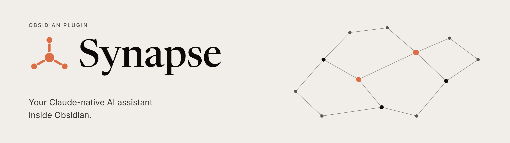
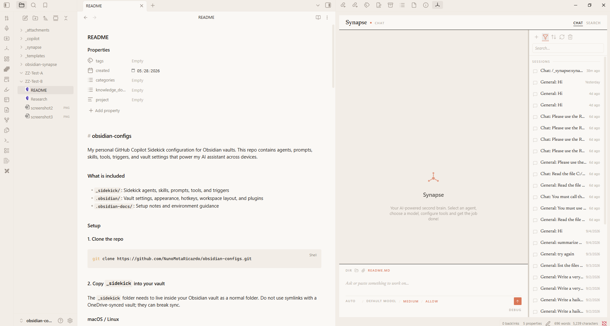

<picture>
  <source media="(prefers-color-scheme: dark)" srcset="./wiki/images/synapse_banner2.png">
  
</picture>

# Synapse

### Your notes already hold what you know. Synapse puts Claude to work on them.

Most AI tools make you copy notes into a chat window and paste the answers back. Synapse works
the other way round. It brings the **Claude agent** into Obsidian, where it can read your notes,
follow your links, write and reorganize files, run tools, and keep a history of every
conversation. Your vault becomes the agent's workspace.

It isn't a thin chat wrapper. Synapse is a **native Claude Agent SDK plugin**: every message runs
on the same agent loop as Claude Code. You get real sessions, subagents, skills, MCP tools,
permission controls, and live reasoning, all inside your vault.

### Claude when you need the best. Local models when you want privacy.

Synapse runs **Claude** and **local models through Ollama** in the same agent. Switch models from
the chat panel, or bind a model to each agent. Keep private notes on your own machine and bring in
Claude for the hard problems. You can also use Ollama's cloud models, or any endpoint that speaks
the **Anthropic Messages API**.

Local models aren't a stripped-down mode. They run through the same Claude Agent SDK, so they get
the same sessions, skills, subagents, and MCP tools as Claude.

> [!IMPORTANT]
> **Synapse runs on the Claude CLI, which you need to install**, even if you use only local models.
> For Claude, sign in with your Claude subscription or use an Anthropic API key. For local models,
> run [Ollama](https://ollama.com) v0.14.0 or newer and point Synapse at it. Requires Obsidian
> Desktop 1.13.0 or newer.

---

## Why Synapse

**It knows where you are.** The note you're looking at is already in the conversation. Scope a
chat to a folder, drop in files and images, and reopen any past session exactly where you left off.

**It writes like you, not like an AI.** Give Synapse a few pieces you've written and it builds a
style guide from them. Drafts, rewrites, and emails then follow your voice, and AI filler words get
stripped out.

**You shape it by talking to it.** Tell it *"always cite sources in APA"* or *"I need an agent that
turns meeting notes into action items"*. Synapse proposes the agent or skill, shows you the file,
and writes it when you say yes. No config screens, and no reload.

**Everything is a note.** Agents and skills are Markdown files in your vault. Read them, edit
them, version them with git, and sync them across devices like any other note.

**It works where you work.** Chat in the side panel. Right-click selected text to rewrite,
proofread, expand, or summarize it. Right-click a folder to summarize everything in it. Search your
vault by describing what you want. Or message your agents from your phone through Telegram.

**It connects to everything else.** Add MCP servers to give Synapse a browser, GitHub, web search,
or your own tools. Approve each tool call, or allow them once you trust your setup.

---

## Useful from the first message: the starter kit

Synapse installs a small starter kit into `_synapse/` on first run. It's useful from day one, and
built to be made your own.

| | What it gives you |
|---|---|
| **`synapse-config`** skill | Customizes Synapse from chat. Describe what you want and it proposes an agent, skill, or MCP server, shows you the exact file, and writes it only after you approve. It also runs the **setup workflow**, which builds writing styles from your own documents. |
| **Writer** agent | Delivers finished prose, not outlines: essays, reports, proposals, emails, speeches, and articles. It picks the right structure, asks only for what's missing, and hands over the whole piece. |
| **`writing-style`** skill | Controls how the words sound. It uses your own styles when you have them, falls back to four built-in voices (personal, technical, spoken, professional), and strips AI-sounding phrasing. |
| **`think`** skill | Helps you think before anything gets written. It asks one question at a time, suggests an answer, and checks your vault first so it doesn't ask what you've already written down. |
| **`obsidian`** skill | Obsidian know-how: wikilinks, embeds, callouts, properties, **Bases**, and the `obsidian` CLI. What it writes renders correctly the first time. |

### Start here: make it yours with `synapse-config`

Open Synapse and type:

> **Set up my writing styles.**

`synapse-config` suggests a style for each kind of writing you do. It asks for 3–5 pieces you wrote
yourself, studies their voice, structure, rhythm, and vocabulary, and shows you a style file to
approve. From then on, the Writer agent and every rewrite sound like you.

The same skill lets Synapse keep growing with you. Whenever you notice you're repeating an
instruction, turn it into an agent or skill in a single message.

---

## Get started in three steps

1. **Install the [Claude CLI](https://code.claude.com/docs/en/setup)** and sign in by running `claude`,
   or have an Anthropic API key ready. For local models, also install [Ollama](https://ollama.com).
2. **Install Synapse** with [BRAT](https://github.com/TfTHacker/obsidian42-brat) by adding
   `https://github.com/NunoMotaRicardo/obsidian-synapse`, or manually from the
   [latest release](https://github.com/NunoMotaRicardo/obsidian-synapse/releases).
3. **Open Synapse** from the ribbon icon or the command **Open chat**, and ask it to set up your
   writing styles.

Full walkthrough, including local models: **[Installation](wiki/Installation.md)**.

> [!CAUTION]
> **With great power comes great responsibility.** Synapse can run tools, execute commands, and
> modify files on your behalf. Keep tool approval on **Ask** until you trust your setup. This
> open-source software comes without warranty or support. Use at your own risk.

---

## Learn more

The [wiki](wiki/Home.md) has the details:

- **[Installation](wiki/Installation.md)**: requirements, the Claude CLI, BRAT or manual install, and first run
- **[Using Synapse](wiki/Using-Synapse.md)**: the chat panel, search, sessions, and editor actions
- **[Starter kit](wiki/Starter-Kit.md)**: every bundled skill and agent, and the `synapse-config` setup workflow
- **[Customization](wiki/Customization.md)**: agents, skills, MCP servers, and vault settings in `_synapse/`
- **[Configuration](wiki/Configuration.md)**: every settings tab
- **[Local models with Ollama](wiki/Local-Models-Ollama.md)**: running Synapse on local or cloud Ollama models
- **[Telegram bot](wiki/Telegram-Bot.md)**: chatting with your agents from anywhere

## Credits

Thank you to [Alexandre Vieira](https://github.com/vieiraae), for the work on [obsidian-sidekick](https://github.com/vieiraae/obsidian-sidekick), a sibling of Synapse. Sidekick is an Obsidian assistant built on the GitHub Copilot SDK.

## Contributing

Working on the code, as a person or an AI agent? Start with [`specs/ARCHITECTURE.md`](specs/ARCHITECTURE.md), then read [`CONTRIBUTING.md`](CONTRIBUTING.md).

## Feedback

Found a bug or have an idea? [Open an issue](https://github.com/NunoMotaRicardo/obsidian-synapse/issues).
All feedback is welcome.
