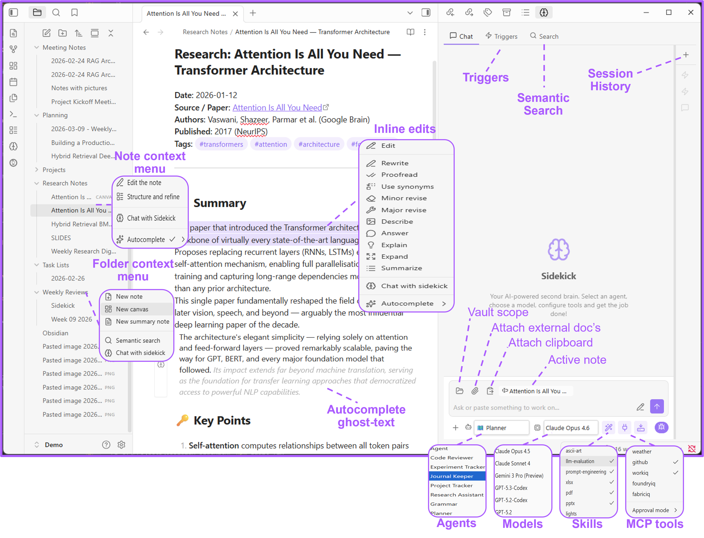

# Synapse


Your Claude-native AI assistant inside Obsidian. Chat with agents, run tools, search your vault with AI, and transform text — all without leaving your notes.

Synapse connects to Claude (via the Anthropic API or OAuth) or your own local AI provider (like Ollama) and gives you a fully configurable assistant panel with agents, skills, MCP tool servers, and an AI-powered editor.

---

## Overview

The Synapse panel sits in the right sidebar alongside your notes. Pick an agent, toggle skills and tools, then chat — responses stream in with full Markdown rendering and collapsible tool-call details.



**What you see above:** the chat tab with an active agent, model selector, reasoning toggle, and a streamed response. The session sidebar on the right lists past conversations. Context-menu actions and search all work from the same panel.

> [!CAUTION]
> **With great power comes great responsibility.** This plugin can execute tools, run CLI commands, and modify your files on your behalf. This software is provided as open-source without any warranty or support. Use at your own risk.

---

## Quick start

> [!IMPORTANT]
> Synapse requires Obsidian Desktop 1.13.0 or newer (Node.js 20.19+ runtime) and talks to the Claude CLI via `@anthropic-ai/claude-agent-sdk`.

1. **Install** — Either:
   - **Via BRAT** — Install the [BRAT](https://github.com/TfTHacker/obsidian42-brat) community plugin, then add this repository as a beta plugin. BRAT handles downloads and updates automatically.
   - **Manual** — Download `main.js`, `styles.css`, and `manifest.json` from the latest release into `<YourVault>/.obsidian/plugins/synapse/`. Then reload Obsidian and enable **Synapse** in **Settings → Community plugins**.
2. **Configure API / CLI** — Open **Settings → Synapse**. Configure your **Anthropic API Key** or use **OAuth** (Claude Subscription), or configure a local model provider like **Ollama**.
3. **Initialize** — Under **Synapse settings** (Capabilities tab), click **Initialize** to scaffold the config structure under the hardcoded `_synapse/` folder:
   ```
   _synapse/
     agents/    ← *.md agent/persona files
     skills/    ← subfolder per skill with SKILL.md
     .mcp.json  ← MCP server config
   ```
4. **Open Synapse** — Click the **brain** icon in the ribbon, or run **Open Synapse** from the command palette.

More detail, including troubleshooting: [Installation](wiki/Installation.md).

You're ready. Start chatting, or read on to unlock every feature.

---

## Table of contents

- [The Synapse panel](#the-synapse-panel)
- [Agents](#agents)
- [Models](#models)
- [Skills](#skills)
- [MCP Tools (MCP servers)](#mcp-tools-mcp-servers)
- [Browser use](#browser-use)
- [Bots](#bots)
- [Inline edits](#inline-edits)
- [Settings reference](#settings-reference)
- [Using your vault with Claude / VS Code](#using-your-vault-with-claude--vs-code)
- [Feedback](#feedback)

---

## The Synapse panel

The panel lives in the right sidebar and has two tabs: **Chat** and **Search**.

### Chat tab

A streaming AI conversation with full Markdown rendering. Type a message and press **Enter** to send (**Shift+Enter** for newlines).

**While a response is in flight**, the status indicator tells you which stage the turn is at:

| Indicator | Meaning |
|---------|-------------|
| **Waiting for response…** | Sent — nothing has streamed back yet |
| **Thinking…** (in a collapsible block) | The model is streaming its reasoning; expand the block to read it live |
| **Processing…** | A tool call is running mid-turn |

Models that don't produce reasoning go straight from **Waiting for response…** to the answer — no
reasoning block appears, because there is none to show.

**Toolbar:**

| Control | What it does |
|---------|-------------|
| **+** | New conversation |
| **↻** | Reload all config files |
| **Agent** dropdown | Pick an agent — auto-selects its model, tools, and skills |
| **Model** dropdown | Switch AI model |
| **Reasoning** (brain icon) | Set reasoning effort (low / medium / high / xhigh) — appears when the selected model supports it |
| **Skills** (wand icon) | Toggle skills on/off |
| **Tools** (plug icon) | Toggle MCP servers on/off |
| **Working dir** (drive icon) | Set the working directory for file operations |
| **Debug** (bug icon) | Show tool calls, token usage, and timing |

**Input bar:**

| Button | What it does |
|--------|-------------|
| **Folder** | Set a vault scope — limit which files and folders the AI can see |
| **Paperclip** | Attach files from your OS |
| **Clipboard** | Paste clipboard text as an attachment |

The **active note** is automatically included as context. The working directory follows the active note's parent folder.

### Search tab

AI-powered semantic search across your vault. Toggle between **basic** mode (quick answers, minimal config) and **advanced** mode (pick an agent, model, skills, and tools for the search).

### Session sidebar

The right edge of the panel lists your conversation sessions.

- **Click** a session to restore it — its full message history is replayed from disk, so
  conversations survive restarting Obsidian.
- **Right-click** to rename or delete.
- **Filter** sessions with the search box.
- A **green dot** means a session is actively streaming.
- Search sessions run in the background and are tagged accordingly.

Sessions are auto-named as `<Agent>: <first message>`.

> [!NOTE]
> A restored conversation replays messages and reasoning, but not the collapsible tool-call blocks
> from the original turns. Those are only rendered live.

---

## Agents

Agents live in `_synapse/agents/` as `*.md` files. Each one defines a persona with its own system prompt, preferred model, and access controls.

### Example: `grammar.md`

```yaml
---
name: Grammar
description: Helps users improve their writing
model: sonnet
skills:
  - ascii-art
---

You are the **Grammar Assistant** — help users write clearly and correctly.
```

### Frontmatter fields

| Field | Required | Description |
|-------|----------|-------------|
| `name` | Yes | Display name in the agent dropdown |
| `description` | No | Short purpose description |
| `model` | No | Preferred model (auto-selected when the agent is chosen) |
| `tools` | No | List of allowed tool names (omit = inherit all) |
| `disallowedTools`| No | Explicitly blocked tool names |
| `skills` | No | List of skill names to preload |

The Markdown body is the agent's **system prompt**, sent as context with every message.

---

## Models

Synapse is built natively for Claude models (via the Anthropic API or OAuth). It also supports local models (e.g. Ollama, Microsoft Foundry Local, and other OpenAI-compatible local endpoints) as a free, offline alternative.

### Supported providers

Configure local providers under **Settings → Synapse → Claude → Local & custom providers**. The dropdown has three presets
(Ollama, OpenAI-compatible, Azure OpenAI), but the OpenAI-compatible preset works unchanged with
any endpoint exposing `/v1/chat/completions` — which covers most of the table below:

| Provider | Preset | Base URL | Notes |
|---|---|---|---|
| Ollama (local) | Ollama | `http://localhost:11434` | Default. Capabilities auto-detected |
| Ollama Cloud | Ollama | `http://localhost:11434` | `ollama signin`, pull a `:cloud` model |
| OpenRouter | OpenAI-compatible | `https://openrouter.ai/api/v1` | 400+ models, one key |
| OpenAI | OpenAI-compatible | `https://api.openai.com` | |
| LM Studio | OpenAI-compatible | `http://localhost:1234/v1` | |
| llama.cpp server | OpenAI-compatible | `http://localhost:8080/v1` | |
| vLLM | OpenAI-compatible | `http://localhost:8000/v1` | |
| Groq / Together / DeepSeek / Mistral | OpenAI-compatible | provider's `/v1` | |
| Foundry Local | OpenAI-compatible | `http://localhost:<port>/v1` | Port from `foundry service status`. **Model list unavailable** — enter the id manually |
| Azure OpenAI | Azure OpenAI | `https://<res>.openai.azure.com/openai` | v1 API only; classic deployment URLs unsupported |
| Anthropic | — | — | Use **Settings → Claude → API key**, not this section |

### Running local models through the full Claude Agent SDK

By default, local models run through a simplified loop with no skills, subagents, sessions,
permission modes, or streaming. Ollama v0.14.0+ speaks the same Anthropic Messages API the Claude
CLI itself uses, so pointing Synapse at it gets a local model the *full* agent experience instead.

Under **Settings → Synapse → Claude → Local agent endpoint (advanced)**, set:

- **Endpoint URL** — `http://localhost:11434` for a local Ollama v0.14.0+, or any other endpoint
  that speaks the Anthropic Messages API. Leave blank (default) to keep the simplified local loop.
- **Endpoint API key** — optional; Ollama requires the header but ignores its value, so leave this
  blank to send `ollama` automatically.

The section's **Test** button verifies the endpoint end to end: it sends one minimal
`/v1/messages` request with the same credentials the agent path uses and reports whether the
endpoint answered in Messages API shape — so a typo'd URL or a non-Messages-API server is caught
at configuration time, not mid-conversation.

A configured endpoint redirects the *entire* agent loop for a local-model query — including tool
calls — to that address, so only point it at an endpoint you trust with your conversation and tool
data (loopback Ollama by default; treat a remote/proxied endpoint the same as any other network
destination you'd send vault content to).

---

## Skills

Skills are subfolders inside `_synapse/skills/`, each containing a `SKILL.md` file that provides domain-specific knowledge to the AI.

### Example: `_synapse/skills/ascii-art/SKILL.md`

```yaml
---
name: ascii-art
description: Generates stylized ASCII art text using block characters
---

# ASCII Art Generator

Generate ASCII art representations of text using block-style Unicode characters.
```

Toggle skills on/off from the **wand** icon in the toolbar.

---

## MCP Tools (MCP servers)

Configure external tool servers in `_synapse/.mcp.json`. Synapse discovers and spawns stdio and SSE-based MCP servers.

### Example: `.mcp.json`

```json
{
  "mcpServers": {
    "workiq": {
      "command": "npx",
      "args": ["-y", "@microsoft/workiq", "mcp"]
    },
    "my-local-tool": {
      "command": "node",
      "args": ["./my-tool/index.js"],
      "env": { "API_KEY": "..." }
    }
  }
}
```

### Tool approval

In **Settings → Synapse → Tools**, set **Tools approval**:

- **Allow** — Tool calls run automatically.
- **Ask** — Confirm each tool call in a modal before execution.

---

## Browser use

Give Synapse control of a real browser — navigate pages, click elements, fill forms, take screenshots, and extract content — all driven by AI through the Playwright MCP server.

### 1. Install the browser extension

Install the [Playwright MCP Bridge](https://chromewebstore.google.com/detail/playwright-mcp-bridge/mmlmfjhmonkocbjadbfplnigmagldckm) extension on any Chromium browser (Edge, Chrome).

### 2. Add the Playwright MCP server

In `_synapse/.mcp.json`, add the `playwright-extension` server:

```json
{
  "mcpServers": {
    "playwright-extension": {
      "command": "npx",
      "args": ["@playwright/mcp@latest", "--extension"]
    }
  }
}
```

---

## Bots

Connect external messaging platforms to Synapse so you can chat with your agents from anywhere — not just inside Obsidian.

### Telegram

Turn a Telegram bot into a front-end for your Synapse agents. Messages you send in Telegram are processed by Synapse using your configured agent, model, skills, and MCP tools — then the response is sent back to the chat.

#### 1. Create a Telegram bot

1. Open Telegram and message [@BotFather](https://t.me/BotFather).
2. Send `/newbot` and follow the prompts.
3. Copy the **bot token**.

#### 2. Configure in Synapse

Go to **Settings → Synapse → Bots**:

| Setting | Description |
|---------|-------------|
| **Bot ID** | Your bot's username — informational only |
| **Bot token** | The token from BotFather (stored securely) |
| **Allowed users** | Comma-separated Telegram user IDs (required) |
| **Default agent** | Which agent responds to incoming messages |

The bot silently ignores messages from anyone not in the allowed list. Use the `/new` command in Telegram to reset the session.

---

## Inline edits

### Editor context menu

Right-click in any note → **Synapse** to access inline AI actions. The menu adapts based on whether you have text selected.

If you prefer not to see the inline Synapse icon beside the active line, disable **Show inline Synapse icon** in **Settings → Synapse → Capabilities**.

#### With text selected

| Action | What happens |
|--------|-------------|
| **Edit** | Opens the Edit modal with tone, format, and length controls |
| **Rewrite** | Improves clarity and readability |
| **Proofread** | Fixes grammar, spelling, and punctuation |
| **Use synonyms** | Swaps words for variety |
| **Minor revise** | Polishes without changing meaning |
| **Major revise** | Reworks structure and flow |
| **Describe** | Explains what the text conveys |
| **Answer** | Responds to a question in the text |
| **Explain** | Breaks down in simple terms |
| **Expand** | Adds detail and depth |
| **Summarize** | Creates a concise summary |
| **Chat with Synapse** | Opens chat with the selection as context |

Quick actions **replace the selected text** in-place using the **Inline operations model**.

#### Without a selection

| Action | What happens |
|--------|-------------|
| **Edit the note** | Opens the Edit modal for the whole note |
| **Structure and refine** | Restructures and improves the entire note |
| **Chat with Synapse** | Opens the chat panel |

### File and folder context menu

Right-click a file or folder in the vault explorer → **Synapse**.

- **Markdown files:** Edit the note, Structure and refine, Chat with Synapse.
- **Folders:** New note (AI-generated), New summary note (summarizes all notes in the folder), Chat with Synapse.
- **Images:** Insert extracted content below, Replace with extracted content, or Convert to mermaid diagram below — uses AI to pull text from images or generate a Mermaid diagram representing the image.

---

## Settings reference

### Settings → Synapse → Claude → Local & custom providers

| Setting | Default | Description |
|---------|---------|-------------|
| **Provider** | Ollama | `Ollama`, `OpenAI-compatible`, or `Azure OpenAI` — see [Supported providers](#supported-providers) |
| **Base URL** | `http://localhost:11434` | Endpoint for the selected preset |
| **Model name** | *(empty)* | Model ID for local-provider operations (e.g. `llama3`) — select from Test results or type a custom ID |
| **API key** | *(empty)* | Credentials for the chosen provider (hidden when **Provider** is Ollama) |

### Settings → Synapse → Tools

| Setting | Default | Description |
|---------|---------|-------------|
| **Tools approval** | Ask | `Allow` (auto) or `Ask` (confirm each call) |

### Chat panel toolbar (per-session, not in Settings)

These are configured from the config toolbar inside the chat panel itself, not from **Settings → Synapse**:

| Setting | Default | Description |
|---------|---------|-------------|
| **Reasoning effort** | *(unset)* | Low / Medium / High / XHigh — when supported by the model |
| **Search mode** | Basic | `Basic` (quick) or `Advanced` (full agent/model/skills/tools config) |

Full reference, including every tab: [Configuration](wiki/Configuration.md).

---

## Using your vault with Claude / VS Code

Your Synapse agents, skills, and tools can also work with Claude CLI or VS Code. Simply create a `.github` symbolic link pointing to your `_synapse` folder — developer tools automatically pick up instructions, agents, and MCP configurations from `.github/`.

### Create the symlinks

Open a terminal at your vault root and run:

**Windows (PowerShell — run as Administrator):**

```powershell
New-Item -ItemType SymbolicLink -Path ".github" -Target "_synapse"
```

**macOS / Linux:**

```bash
ln -s _synapse .github
```

---

## Contributing

Working on the codebase (human or AI agent)? Start with [`specs/architecture.md`](specs/architecture.md)
for a system overview and the module map, then the matching `specs/<module>.md` for the module
you're changing. See [`CONTRIBUTING.md`](CONTRIBUTING.md) for the dev workflow.

## Feedback

Found a bug or missing a feature? [Open an issue](https://github.com/NunoMotaRicardo/obsidian-synapse/issues) — all feedback is welcome.
