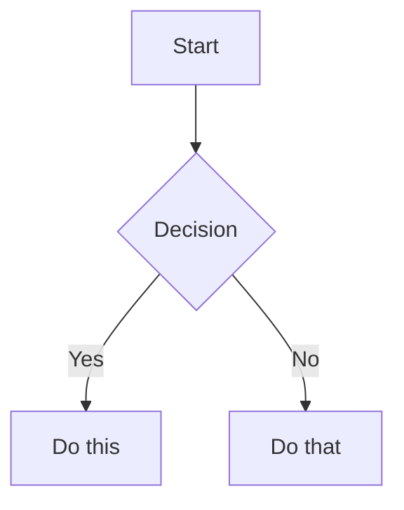

# Obsidian Flavored Markdown

Obsidian extends CommonMark and GFM. Only Obsidian-specific syntax is covered here; standard Markdown (headings, emphasis, lists, quotes, code blocks, tables, task lists) is assumed.

## Internal Links (Wikilinks)

```markdown
[[Note Name]]                          Link to note
[[Note Name|Display Text]]             Custom display text
[[Note Name#Heading]]                  Link to heading
[[Note Name#^block-id]]                Link to block
[[#Heading in same note]]              Same-note heading link
```

Define a block ID by appending `^block-id` to any paragraph:

```markdown
This paragraph can be linked to. ^my-block-id
```

For lists and quotes, place the block ID on its own line after the block:

```markdown
> A quote block

^quote-id
```

## Embeds

Prefix any wikilink with `!` to embed its content inline.

```markdown
![[Note Name]]                         Full note
![[Note Name#Heading]]                 Section
![[Note Name#^block-id]]               Block (or a list with a block ID)

![[image.png]]                         Image
![[image.png|300]]                     Width only (keeps aspect ratio)
![[image.png|640x480]]                 Width x Height
       External image
   External image with width

![[audio.mp3]]                         Audio (mp3, ogg, …)

![[document.pdf]]                      PDF
![[document.pdf#page=3]]               PDF page
![[document.pdf#height=400]]           PDF with height

![[MyBase.base]]                       Base (see bases.md)
![[MyBase.base#View Name]]             Specific base view
```

Search results embed:

````markdown
```query
tag:#project status:done
```
````

## Callouts

```markdown
> [!note]
> Basic callout.

> [!info] Custom Title
> Callout with a custom title.

> [!tip] Title Only

> [!faq]- Collapsed by default
> Hidden until expanded.

> [!faq]+ Expanded by default
> Visible but collapsible.

> [!question] Outer callout
> > [!note] Inner callout
> > Nested content
```

### Supported types

| Type | Aliases | Color / Icon |
|------|---------|-------------|
| `note` | - | Blue, pencil |
| `abstract` | `summary`, `tldr` | Teal, clipboard |
| `info` | - | Blue, info |
| `todo` | - | Blue, checkbox |
| `tip` | `hint`, `important` | Cyan, flame |
| `success` | `check`, `done` | Green, checkmark |
| `question` | `help`, `faq` | Yellow, question mark |
| `warning` | `caution`, `attention` | Orange, warning |
| `failure` | `fail`, `missing` | Red, X |
| `danger` | `error` | Red, zap |
| `bug` | - | Red, bug |
| `example` | - | Purple, list |
| `quote` | `cite` | Gray, quote |

Custom callout types are defined with a CSS snippet:

```css
.callout[data-callout="custom-type"] {
  --callout-color: 255, 0, 0;
  --callout-icon: lucide-alert-circle;
}
```

## Properties (Frontmatter)

YAML frontmatter at the very start of the note:

```yaml
---
title: My Note Title
date: 2024-01-15
tags:
  - project
  - important
aliases:
  - Alternative Name
cssclasses:
  - custom-class
status: in-progress
rating: 4.5
completed: false
due: 2024-02-01T14:30:00
related: "[[Other Note]]"
---
```

| Type | Example |
|------|---------|
| Text | `title: My Title` |
| Number | `rating: 4.5` |
| Checkbox | `completed: true` |
| Date | `date: 2024-01-15` |
| Date & Time | `due: 2024-01-15T14:30:00` |
| List | `tags: [one, two]` or YAML list |
| Links | `related: "[[Other Note]]"` (always quoted) |

Default properties:
- `tags` — searchable labels, shown in graph view
- `aliases` — alternative note names, used in link suggestions
- `cssclasses` — CSS classes applied to the note in reading/editing view

## Tags

```markdown
#tag
#nested/tag
#tag-with-dashes
#tag_with_underscores
```

Allowed characters: letters (any language), numbers (not as first character), `_`, `-`, `/` (nesting). In frontmatter, list tags under `tags` without the `#`.

## Comments

```markdown
This is visible %%but this is hidden%% text.

%%
This entire block is hidden in reading view.
%%
```

## Highlight

```markdown
==Highlighted text==
```

## Math (LaTeX)

```markdown
Inline: $e^{i\pi} + 1 = 0$

Block:
$$
\frac{a}{b} = c
$$
```

## Diagrams (Mermaid)

````markdown

````

`class NodeName internal-link;` makes a node link to the note of the same name.

## Footnotes

```markdown
Text with a footnote[^1].

[^1]: Footnote content.

Inline footnote.^[This is inline.]
```

## Complete Example

````markdown
---
title: Project Alpha
date: 2024-01-15
tags:
  - project
  - active
status: in-progress
---

# Project Alpha

This project aims to [[improve workflow]] using modern techniques.

> [!important] Key Deadline
> The first milestone is due on ==January 30th==.

## Tasks

- [x] Initial planning
- [ ] Development phase
  - [ ] Backend implementation
  - [ ] Frontend design

## Notes

The algorithm uses $O(n \log n)$ sorting. See [[Algorithm Notes#Sorting]] for details.

![[Architecture Diagram.png|600]]

Reviewed in [[Meeting Notes 2024-01-10#Decisions]].
````

## Checklist

- [ ] Frontmatter starts on line 1, between `---` lines, and is valid YAML
- [ ] Link-type property values are quoted: `"[[Note]]"`
- [ ] Internal links are wikilinks; only external URLs use `[text](url)`
- [ ] Block IDs for lists and quotes sit on their own line after the block
- [ ] Every callout type is in the supported table (or has a custom CSS definition)
- [ ] No tag starts with a digit or contains spaces

## Docs

[Obsidian Flavored Markdown](https://help.obsidian.md/obsidian-flavored-markdown) · [Links](https://help.obsidian.md/links) · [Embeds](https://help.obsidian.md/embeds) · [Callouts](https://help.obsidian.md/callouts) · [Properties](https://help.obsidian.md/properties)
