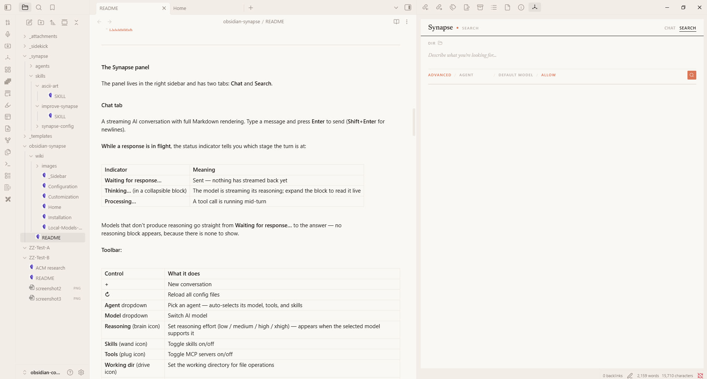
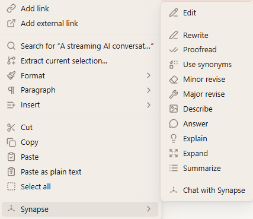
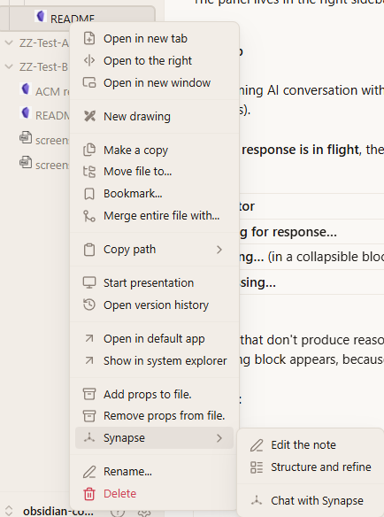
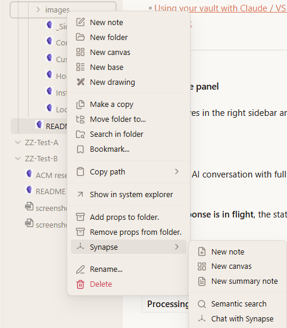

# Using Claude Synapse

Claude Synapse is available in three places: the **Claude Synapse panel** in the right sidebar, the **context
menus** in the editor and file explorer, and an optional [Telegram bot](Telegram-Bot.md). All of
them use the same agents, skills, and MCP tools from `_synapse/`.

Open the panel from the Claude Synapse ribbon icon or the command **Open chat**.

## The panel

The panel has two tabs, **Chat** and **Search**, plus a session list.

### Chat

A streaming conversation with full Markdown rendering. Press **Enter** to send and
**Shift+Enter** for a new line. Type `/` to pick a skill to run.

**Context comes along automatically.** The line above the input shows the active note (or your
selection), the agent, and the model. The active note is included with each message, and the
working directory follows the note's folder.

**Composer controls:**

| Control | What it does |
|---|---|
| **Scope** (folder icon) | Limits which files and folders the assistant can see |
| **Attach** (paperclip) | Attaches files from your computer. You can also drag files onto the input or paste images |

**Toolbar:**

| Control | What it does |
|---|---|
| **Agent** | Picks an agent from `_synapse/agents/`. The agent's model, tools, and skills apply |
| **Model** | Switches between Claude models and models from your [local agent endpoint](Local-Models-Ollama.md) |
| **Reasoning** | Sets reasoning effort when the model supports it |
| **Tools** | Lists MCP tools and sets **Approval mode**: **Ask** before each tool call, or **Allow** automatically |
| **Context gauge** | Shows how much of the model's context window the conversation uses |
| **Debug** | Shows tool calls, token usage, and timing inline |

**While a response is in flight** the status shows the stage: **Waiting for response…** (nothing
streamed yet), **Thinking…** (reasoning streams live in a collapsible block), or **Processing…**
(a tool is running). Models without reasoning go straight to the answer.

When a tool needs approval, a dialog shows exactly what will run. **Allow** grants it for this
conversation, **Always allow** saves the rule to `_synapse/settings.json`, and **Deny** refuses it.
See [Customization → Vault settings](Customization.md#5-vault-settings-_synapsesettingsjson).

### Search

Describe what you're looking for in plain language and an agent searches the vault. **Basic** mode
is quick. **Advanced** mode lets you choose the agent, model, and tool approval for the search.
Click a result to open the note.

### Sessions

Every conversation is saved. Use the session list to start a **New session**, filter by type,
sort, and search by name. Click a session to reopen it with its full history, even after
restarting Obsidian. Rename or delete sessions from their buttons. A green dot marks a session
that is still streaming, and search runs appear as their own session type.

> [!NOTE]
> A reopened conversation replays messages and reasoning, but not the collapsible tool-call blocks
> from the original turns. Those appear only live.

## Editor and file actions

### In a note

Right-click in the editor and open **Claude Synapse**.

**With text selected:**

| Action | What happens |
|---|---|
| **Edit** | Opens the Edit dialog with task, tone, format, and length controls, and can generate several alternatives |
| **Rewrite** | Improves clarity and readability |
| **Proofread** | Fixes grammar, spelling, and punctuation |
| **Use synonyms** | Varies word choice |
| **Minor revise** / **Major revise** | Polishes lightly, or reworks structure and flow |
| **Describe** / **Explain** | Describes what the text conveys, or explains it simply |
| **Answer** | Answers a question in the selection |
| **Expand** / **Summarize** | Adds depth, or condenses |
| **Chat with Claude Synapse** | Opens the chat with the selection as context |

Quick actions replace the selection in place. **Without a selection**, the menu offers **Edit the
note**, **Structure and refine** (restructures the whole note), and **Chat with Claude Synapse**.

### In the file explorer

Right-click a note or folder and open **Claude Synapse**.

  
  

- **Notes:** **Edit the note**, **Structure and refine**, **Chat with Claude Synapse**.
- **Folders:** **New note** and **New canvas** (generated from your description), **New summary
  note** (summarizes every note in the folder), **Semantic search** (scoped to the folder), and
  **Chat with Claude Synapse**.
- **Images:** extract the image's text below it or in its place, or convert it into a Mermaid
  diagram. These actions use the agent mapped to **Vision** in **Settings → Claude Synapse → Feature Map &
  Agents**.

The note and selection actions are also commands in the command palette, so you can assign hotkeys.

## Choosing agents per feature

In **Settings → Claude Synapse → Feature Map & Agents**, pick the default agent for the chat panel,
editor actions, search, Telegram, and image actions. **Auto** uses Claude's default agent. For
example, map editor actions to the starter kit's **Writer** so rewrites follow your
[writing styles](Starter-Kit.md#writing-style).

## Suggested reading

- [Starter kit](Starter-Kit.md): the bundled skills and agent
- [Customization](Customization.md): write your own agents, skills, and MCP servers
- [Configuration](Configuration.md): every settings tab
